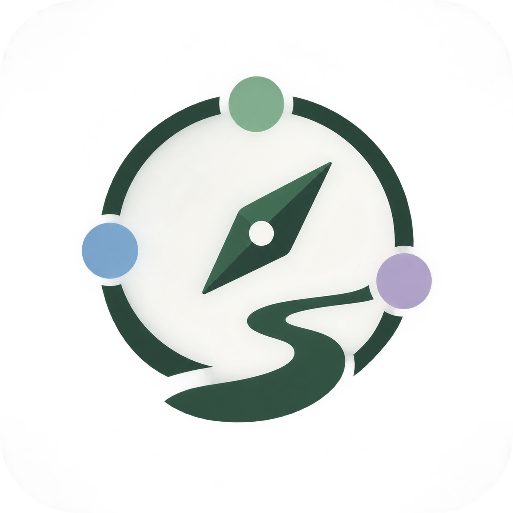
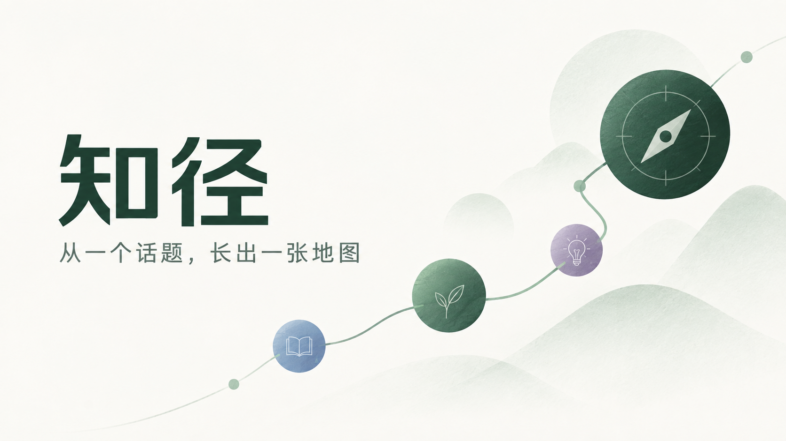

# 知径

<p align="center">
  
</p>

<p align="center"><strong>从一个话题，长出一张地图</strong></p>

<p align="center">
  
</p>

知径是一款面向泛兴趣学习者的知识地图产品。输入一个想学的话题，知径从知乎社区中找到相关学习资源，将它们编排成一条由浅入深、可以持续探索的学习路径。

在线体验：<https://zhijing.onrender.com/>

## 产品体验

- **从话题开始**：输入数学、编程、摄影或任何想了解的领域。
- **生成学习路径**：将话题拆成入门、进阶、深入三层知识节点，先建立全貌，再决定深入方向。
- **逐点发现资源**：每个节点关联最多三条知乎学习资源，综合搜索相关性与社区互动数据组织展示顺序。
- **在地图中探索**：支持拖动、平移、缩放，点击知识点展开资源卫星节点。
- **继续向下钻研**：从一个知识点生成一张一级子地图，沿面包屑返回原来的学习路径。
- **保留学习进度**：点击真实知乎资源后记录本地已学状态，无需登录，不上传用户进度。
- **面对不确定性**：空结果、单节点失败和部分生成都会被明确展示，不会用虚假的完整结果掩盖问题。

## 一次学习流程

```text
输入话题
   ↓
生成知识大纲
   ↓
展示入门 → 进阶 → 深入的地图骨架
   ↓
逐节点加载知乎资源
   ↓
展开资源、阅读原文、记录已学状态
```

知径的核心分工是：AI 负责组织“先学什么、再学什么”，知乎社区数据负责帮助用户发现和判断资源。知径不复制文章全文，也不替代知乎原文阅读。

## 快速开始

环境要求：Node.js `>=22` 和 npm。

```bash
npm install
cp .env.example .env.local
npm run dev
```

打开 <http://127.0.0.1:4173/> 即可使用。默认 `ZHIJING_MOCK_MODE=true`，无需配置凭证即可体验地图生成与探索交互；示例资源是固定 fixture，不代表当前话题的真实知乎内容，也不会打开原文或记录已学进度。

生产构建可以使用：

```bash
npm run build
npm start
```

## 连接知乎开放能力

将 `.env.local` 中的模式切换为真实服务时，只在服务端配置凭证：

```env
ZHIJING_MOCK_MODE=false
ZHIHU_ACCESS_SECRET=<知乎数据开放平台 Access Secret>
ZHIHU_API_BASE_URL=https://developer.zhihu.com
```

可选运行参数：

| 变量 | 用途 | 默认值 |
| --- | --- | --- |
| `ZHIJING_MAP_TTL_SECONDS` | 完整地图的进程内缓存时间 | `86400` |
| `ZHIJING_SEARCH_CONCURRENCY` | 资源搜索并发数 | `2` |
| `ZHIJING_OUTLINE_TIMEOUT_MS` | 学习大纲请求超时 | `120000` |
| `ZHIJING_SEARCH_TIMEOUT_MS` | 资源搜索请求超时 | `10000` |

Access Secret 不应写入源码、前端环境变量、日志或提交记录。所有知乎接口调用都发生在服务端。

## 接口入口

| 方法 | 路径 | 用途 |
| --- | --- | --- |
| `GET` | `/api/health` | 服务健康检查 |
| `POST` | `/api/generate` | 生成完整地图；支持 JSON 或 SSE |
| `POST` | `/api/outline` | 生成知识大纲 |
| `POST` | `/api/resources` | 检索单个知识点的学习资源 |
| `GET` | `/api/map` | 读取进程内地图缓存 |

请求与响应字段、错误语义和 SSE 事件格式见 [API 契约](docs/api-contract.md)。

## 产品边界

- AI 生成的学习顺序、摘要和预计用时仅作为学习参考，不代表知乎作者观点。
- 资源卡片只展示开放接口返回的必要元数据，原文通过知乎链接打开。
- 学习进度仅保存在当前浏览器的 `localStorage` 中，不提供账号同步或服务端进度接口。
- 一级下钻用于从当前知识点继续探索，不提供无限递归、多地图管理或协作编辑。
- 金融、医疗、法律等高风险主题应以官方信息和专业人士意见为准。

## 项目结构

```text
app/                 页面与 API Routes
src/client/          地图画布、交互和本地进度
src/server/          知乎适配、地图生成和资源排序
types/               API 与领域类型
fixtures/            mock 模式示例数据
assets/              产品品牌图片
docs/                产品说明、PRD 与 API 契约
```

## 质量检查

```bash
npm test
npm run check
npm run build
```

## 产品文档

- [项目概念](docs/project-concept.md)：产品定位、价值和体验原则
- [产品需求文档](docs/prd.md)：页面、流程和接口需求
- [API 契约](docs/api-contract.md)：请求、响应、错误与流式事件
- [测试 Fixture 说明](docs/test-fixtures.md)：mock 数据与场景
